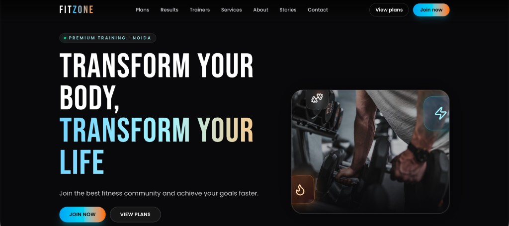
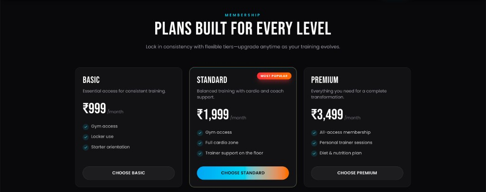
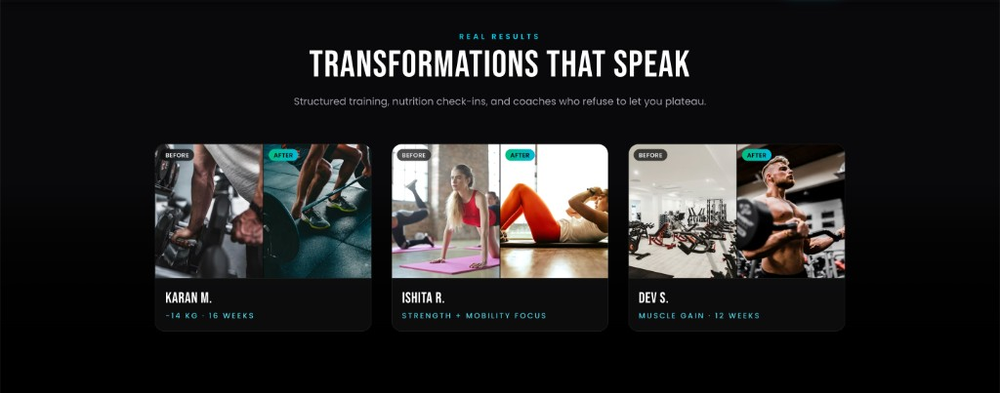
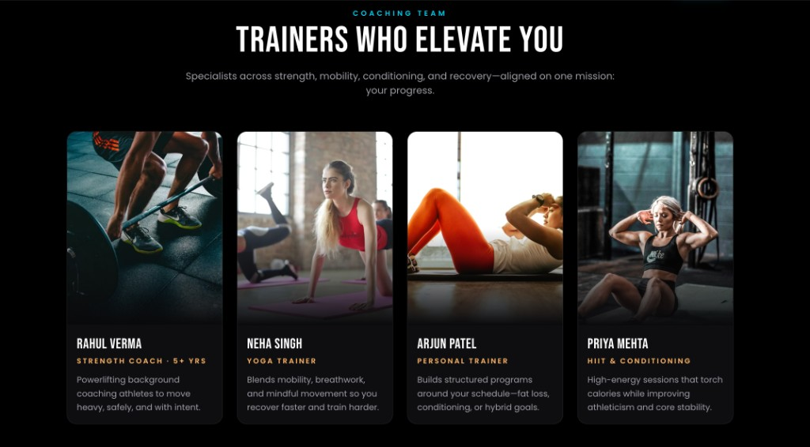

# FitZone Gym — Fitness Trainer Website

A **premium, single-page marketing site** for a gym / personal-training brand: dark UI, neon gradients, motion, and responsive layouts aimed at owners who want a **strong, modern web presence**.

[](https://gym-gitness-trainer-website.vercel.app/)
[](https://react.dev/)
[](https://www.typescriptlang.org/)
[](https://vitejs.dev/)
[](https://tailwindcss.com/)

---

## Live demo

**Production:** [https://gym-gitness-trainer-website.vercel.app/](https://gym-gitness-trainer-website.vercel.app/)

Open the demo for the full experience (animations, hover tilt on cards, smooth scrolling).

---

## Preview

<table>
  <tr>
    <td align="center"><b>Hero</b></td>
    <td align="center"><b>Membership plans</b></td>
  </tr>
  <tr>
    <td></td>
    <td></td>
  </tr>
  <tr>
    <td align="center"><b>Transformations</b></td>
    <td align="center"><b>Trainers</b></td>
  </tr>
  <tr>
    <td></td>
    <td></td>
  </tr>
</table>

---

## Highlights

- **Brand-forward hero** — Full-viewport gym scene, gradient headline, dual CTAs, stats strip, accent panel with training imagery and floating icon chips.
- **Membership tiers** — Basic / Standard / Premium (₹999–₹3,499) with featured tier, **3D tilt + glare** on hover (`react-parallax-tilt`).
- **Social proof** — Before/after grid, testimonials, mid-page CTA band.
- **Team & services** — Trainer cards, four service pillars with icons (Lucide).
- **Contact** — Phone, Noida location, **WhatsApp** deep link (`wa.me`).
- **Accessibility & polish** — Skip link, focus-visible rings, `prefers-reduced-motion` handling, lazy-loaded below-fold images.

---

## Tech stack

| Layer | Choice |
|--------|--------|
| UI | React 19 + TypeScript |
| Build | Vite 8 |
| Styling | Tailwind CSS v4 (`@tailwindcss/vite`) |
| Motion | Framer Motion |
| Micro-interactions | `react-parallax-tilt` |
| Icons | `lucide-react` |
| Typography | [Bebas Neue](https://fonts.google.com/specimen/Bebas+Neue) + [Poppins](https://fonts.google.com/specimen/Poppins) (Google Fonts) |
| Imagery | Remote Unsplash URLs (configurable in `src/lib/constants.ts`) |

---

## Getting started

```bash
git clone https://github.com/abhishekgoyal-a11y/Gym---Fitness-Trainer-Website.git
cd Gym---Fitness-Trainer-Website
npm install
npm run dev
```

Then open the URL Vite prints (usually **http://localhost:5173**).

### Scripts

| Command | Description |
|---------|-------------|
| `npm run dev` | Start dev server with HMR |
| `npm run build` | Typecheck + production bundle to `dist/` |
| `npm run preview` | Serve the production build locally |
| `npm run lint` | ESLint |

---

## Project structure

```
src/
  App.tsx                 # Page shell + section order
  index.css               # Tailwind import + global tokens
  main.tsx
  lib/constants.ts        # Copy, pricing, trainers, URLs
  components/
    Header.tsx            # Sticky nav + mobile menu
    Hero.tsx
    MembershipPlans.tsx
    Transformations.tsx
    Trainers.tsx
    Services.tsx
    About.tsx
    Testimonials.tsx
    CtaBanner.tsx
    Contact.tsx
    Footer.tsx
    SectionHeading.tsx
docs/
  screenshots/            # README preview images (committed)
```

---

## Deployment

This repo is set up for static hosting (e.g. **Vercel**): build command `npm run build`, output directory **`dist`**. The live demo above reflects that setup.

---

## Repository

**GitHub:** [github.com/abhishekgoyal-a11y/Gym---Fitness-Trainer-Website](https://github.com/abhishekgoyal-a11y/Gym---Fitness-Trainer-Website)

---

## License

No license file is bundled yet. Add a `LICENSE` (e.g. MIT) when you decide how you want this template reused.
